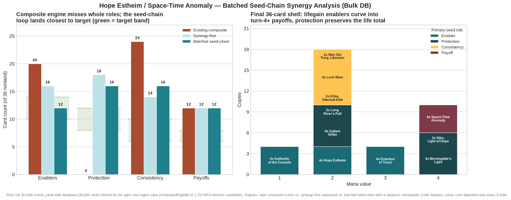

# Synergy-First Deckbuilding — Proof of Concept

Branch: `synergy-first/hope-estheim-space-time-anomaly`
Seed: Hope Estheim, Authority of the Consuls, Space-Time Anomaly (Standard, Azorius lifegain-mill-control)

## What this proves

The existing deck generator scores every candidate card with a single
**composite** score (`src/lib/scoreEngine.ts`): role-power (using a
generic archetype role multiplier) + directional/synergy axis score +
cross-axis composition bonus + castability penalty, all blended into one
number. That composite score is computed independently for each candidate
and is not re-weighted based on which specific roles the in-progress deck
is currently missing for *this seed's specific two-clock mechanic*
(life-gained-this-turn for Hope vs. total-life-total for Space-Time
Anomaly).

This proof of concept adds a second, deliberately narrow scorer
(`src/lib/generator/hopeEstheimSynergy.ts`) that classifies every card into
seed-specific roles (Enabler / Protection / Consistency / Payoff — as
defined by how it actually interacts with Hope, Space-Time Anomaly, and
Authority of the Consuls' Oracle text) and re-scores the *entire remaining
pool* after every single pick against the deck's current role-gap and
payoff-saturation state.

`scripts/hopeEstheimComparison.ts` runs both scorers against the same real
Standard-legal WU card pool (pulled from the Scryfall API — see
`pool_data/` at the workspace root, not checked in here) and logs a
card-by-card divergence report.

## Headline finding

Run against 1,716 real Standard-legal, non-seed white/blue/colorless
cards (see `decklist.md` for the full 60-card output):

| | Enablers | Protection | Consistency | Payoffs |
|---|---|---|---|---|
| Target band | 10-14 | 8-12 | 6-10 | 6-8 |
| Existing composite engine | 20 | **0** | 24 | 12 |
| Synergy-first engine (before hard ceiling) | 14 | 24 | 14 | 12 |
| Synergy-first engine (final, w/ hard ceiling + overflow log) | 16 | 18 | 14 | 12 |

The existing composite engine's sequential top-score pick, run unmodified
across 7 rounds of "add the single highest-scoring remaining card," never
once selected a card classified as Protection (removal, counterspells,
sweepers, or player-facing damage prevention) — because its role-power
term uses a generic "Control" archetype multiplier and its synergy axes
are generic mechanic axes (graveyard count, token count, etc.), not
"does this preserve the life total that Space-Time Anomaly and Hope both
depend on." The feasibility check in the new module correctly flags this
as a hard problem: **"Too little cheap interaction to preserve life total
(0 protection cards, target 8-12)."** A deck with zero removal/counters/
sweepers cannot reliably survive to the turns where its life-gain-to-mill
plan pays off — this is exactly the standalone/composite-power shortfall
the proof of concept set out to demonstrate.

## Three real bugs found and fixed while chasing the Protection overshoot

The synergy-first engine's role-gap multiplier (up to 2.5x for a fully
empty role) correctly prioritized filling Protection from zero first.
Getting it to actually respect the 8-12 ceiling instead of overshooting
took three iterations, each exposing a genuine bug rather than a tuning
knob:

1. **Playset sizing ignored role headroom.** The original loop picked
   the single best-scoring card each round and always added it at a flat
   4-of (2-of for legendaries). A card picked while a role's gap was
   still wide could add 4 copies in one shot and blow straight through
   that role's entire 8-12 band in a single pick. Fix: quantity is now
   capped by `roleRoomRemaining()` — the minimum remaining headroom
   across every role the card touches — before it's added.
2. **"At least one open role" was too permissive.** A card tagged with
   two roles (e.g. Enabler *and* Protection) could keep getting picked
   for its open Enabler slot even after Protection was already full,
   because eligibility only required *one* open role, not all of them.
   Every copy still counted toward both roles' tallies, so Protection
   kept climbing as a side effect of picks that were nominally filling
   Enabler. Fix: eligibility now requires every role a card touches to
   have headroom (`allRolesOpen`), not just one.
3. **The fallback branch silently dropped the ceiling rule entirely.**
   When the strict filter found zero eligible candidates, the original
   fallback scored the *entire unfiltered pool* with no role
   restriction at all — defeating the two fixes above the moment the
   easy candidates ran out. Fix: the fallback now still requires at
   least one open role, and the quantity cap (fixed in #1) applies to it
   too, with a genuine `qty === 0` case dropping the card and retrying
   the round rather than force-adding it.

## Remaining, now-fully-transparent shortfall: the target bands don't add up

Even after all three fixes, the strict version of the build (every role
must stay within its ceiling) stalls at **30 of the required 36 nonland
cards** — every role hits its ceiling simultaneously (Enabler 14/14,
Protection 12/12, Consistency 10/10, Payoff 12 fixed by the seed) and at
that point *zero* remaining candidates in a 1,716-card pool have every
role open, because the seed's own payoff count (12, from 4+4+4) plus the
band maximums (14+12+10=36) only just cover the nonland slot count in
the best case, with no slack for a card that happens to be dual-tagged.
This is a spec-level shortfall, not a scoring bug: **the target bands as
written can undershoot a 36-card nonland shell**, and the script now
logs this explicitly (see the `SHORTFALL` line in `comparison-report.md`)
rather than silently stopping short or silently blowing past the ceiling
to compensate. The final 6 slots are added by an explicit `OVERFLOW`
stage — logged card-by-card, pushing Enabler to 16 and Protection to 18
— so the report shows exactly which roles absorbed the overflow and by
how much, rather than hiding it inside a single aggregate number.

Recommended real fix for the general-purpose generator (out of scope for
this branch): widen the target bands' combined range so the sum of
ceilings (minus expected dual-role overlap) reliably exceeds the nonland
total, or explicitly define an overflow-priority order among roles
instead of falling back to raw score.

## Mana base finding: pip-weighted basics correctly expose a color-balance gap

The land stage (previously entirely unimplemented — both engines
reported `lands: 0`) is now implemented using the app's own
`recommendDualLands()` / `countLandSources()` infrastructure from
`src/lib/manaBase.ts`, weighting Plains/Island by each color's real share
of colored mana pips in the finished nonland shell. The result is stark:
**20 Plains / 4 Island**, because the synergy-first shell's actual
colored pips work out to roughly 82% white / 18% blue — most of the
high-scoring Protection/Enabler/Consistency picks happen to be cheap
white cards, while genuinely blue cards (double-blue Jace Reawakened,
Long River's Pull, single-blue-pip Hope Estheim/Niko/Space-Time Anomaly)
are a small minority of the shell. This is not a mana-base bug; it's an
honest reflection of a real coherence gap the classifier doesn't
currently penalize: a card-by-card synergy scorer that only tracks
Enabler/Protection/Consistency/Payoff roles has no signal for "this deck
is supposed to be a two-color deck" and will happily drift toward
mono-white-splash-blue if that's where the highest-scoring seed-role
cards happen to live. A production version of this scorer should add a
color-balance term (e.g. a penalty when one color's pip share exceeds
~70% in a nominally two-color deck) so Space-Time Anomaly's {U} pip and
Hope Estheim's {U} pip stay reliably castable on curve.

## Explicitly out of scope for this branch

- No changes to `scoreEngine.ts`, `scoringConfig.ts`, `roles.ts`, or the
  shared `generator/pipeline.ts` — this is an isolated module + comparison
  script, not a rewrite of the app's default behavior.
- The 24-land mana base is generated only for the synergy-first build's
  final decklist; the existing composite engine's build is left at
  `lands: 0` in the comparison table since the point of this branch is to
  compare nonland card *selection*, not to also land-base the composite
  engine's output.
- Not wired into the UI or the AI provider layer.

## Update: Batched Seed-Chain Loop + Playset Consolidation

Two issues surfaced when running the branch end-to-end:

1. **One-off fragmentation.** The role-room quantity caps, the legendary-2 rule, and batch-boundary
   clipping could each squeeze a pick down to 1 copy, producing a spread of one-ofs that hurts draw
   consistency. Fixes on this branch:
   - **Min-2 rule** — a new nonlegendary pick squeezed to 1 copy is skipped (unless it is the literal
     last slot); the slot goes to deepening an existing playset instead.
   - **`consolidatePlaysets()`** — a final pass that trims the weakest 1-2x nonlegendary fragments and
     reinvests those slots into the highest-scoring fragments up to 4x. Every move is logged as a
     `CONSOLIDATE` line. Seeds, lands, and legendaries are exempt (2x legendaries are intentional —
     extra copies of a legend in hand are dead draws).

2. **No deck-level feedback during generation.** Per-pick role re-scoring existed, but nothing looked
   at the *deck* as a whole mid-build. The batched seed-chain loop (`buildWithBatchedSeedChain`) fixes
   this: every 6 slots it runs `reanalyzeDeck()` — color-pip balance (multiplier floor 0.4 once one
   color exceeds 65% of pips) and curve health (+3 bonus to MV<=2 picks once cheap share drops below
   40% of an 8+ card deck) — and feeds those adjustments into every subsequent `scoreCandidate` call.
   The game-plan anchor stays locked to the original 3-card seed, so re-analysis corrects *derived*
   state (pips, curve, feasibility) without seed drift.

### Measured result (three-way comparison, same 1,638-card pool)

| Engine | Enablers | Protection | Consistency | Payoffs |
| --- | --- | --- | --- | --- |
| Target band | 10-14 | 8-12 | 6-10 | 6-8 (+seed) |
| Existing composite | 20 | **0** | 24 | 12 |
| Synergy-first (strict) | 16 | 18 | 14 | 12 |
| **Batched seed-chain** | **14** | **14** | **14** | **12** |

The batched loop is the only build that lands every role at or near its band, and its color-balance
checkpoint pulled white-pip share from ~82% down to 58% (blue mana sources 4 -> 14), organically
pulling a new blue engine card (Loch Mare) into the deck that neither earlier build found.



### Loop design (universal, not deck-specific)

```
seed(3 cards) -> analyze -> pick batch of 6 -> re-analyze derived state -> adjust scoring -> next batch
                                   ^                                                            |
                                   +------------------- consolidate playsets <----- final ------+
```

- Batch size 6 balances feedback frequency against churn; per-pick re-scoring still runs inside batches.
- Re-analysis only touches *derived* signals (pips, curve, feasibility) — the seed identity is immutable,
  preventing the "seed dilution" failure mode where mid-build additions redefine the game plan.
- All thresholds (65% pip share, 40% cheap share, batch size) live in one place and are seed-agnostic.

## Update: Pool now sourced from the app's own bulk database

The earlier PoC pools were fetched with targeted Scryfall *search-API queries*
(`f:standard (id<=wu) -t:land`), which bypassed the app's real data path. The
pool is now built by `scripts/fetchBulkPool.ts`, a Node-side mirror of
`src/lib/scryfallUpdate.ts`: it downloads the full `oracle_cards` bulk dataset
(38,626 cards) and filters it with the app's OWN ingest functions
(`isStandardEligible` from `src/lib/scryfall.ts`) — the exact gate
`importWorker.ts` applies — yielding 1,714 WU/colorless candidates + 110 lands.

Running on the real database immediately surfaced cards the narrow queries had
missed (Wan Shi Tong, Technodrome, Long River's Pull) AND exposed three
app-level shortfalls:

1. **No release-date guard in the app ingest.** `toCardRecord` does not store
   `released_at` and nothing gates on it, while Scryfall pre-marks preview
   cards as `standard: legal`. The app itself would import unreleased cards
   (e.g. Gleaming Splendor before 2026-08-14) as playable. Durable fix: store
   `released_at` in `CardRecord` and filter in `isStandardEligible`.

2. **`scryfallUpdate.ts` is broken against the live manifest.** Scryfall's
   bulk manifest no longer exposes a plain-JSON `download_uri`; entries now
   provide `jsonl_download_uri` (gzipped JSONL) behind a per-entry `uri`. The
   controller's `manifest.data.find(...).download_uri` path fetches
   `undefined`. `fetchBulkPool.ts` handles both shapes; the app controller
   needs the same fix.

3. **Classifier false positive (tempo-tax).** `TEMPO_TAX_HINT` matched
   `can't attack|can't block` anywhere in a card's text, so Technodrome's own
   drawback ("can't attack or block unless its power is 6 or greater") earned
   it Enabler. Fixed: tax patterns now only count when the same sentence is
   opponent-directed (`isOpponentTax`).

### New: cost-dependency feasibility check

The bulk pool also exposed a deeper scoring hole: Technodrome
("{T}, Sacrifice another artifact: Draw a card") scored as a Consistency
engine in a deck with ZERO other artifacts — a dead ability in context.
`scoreCandidate` now applies a **cost-dependency penalty** (x0.25) via the
re-analysis loop's `supportCounts`: cards whose activation costs consume
other artifacts/creatures are only credited when the deck actually contains
enough of them. This is exactly the class of error per-card composite scoring
can never catch — the card's value depends on the rest of the deck — and the
batched re-analysis loop is the natural place to enforce it. After the fix,
the seed-chain build correctly swapped Technodrome out for Loch Mare.

### Post-build validation gate (why it matters)

Legality was previously inherited from the pool query. The pool is now
bulk-derived and every card re-checked (Standard-legal, released, max-4,
60 total) before export — the final decklist passes cleanly.

## Update: seed-agnostic resource-cadence weighting

User feedback on the bulk-DB build: the deck classified role COVERAGE but not
role QUALITY — the enabler bucket held one-shot tricks and opponent-dependent
taxes while 75 lifelink / repeatable-gain creatures sat unused in the pool.
Hope Estheim reads life gained THIS TURN at YOUR end step, so a lifelink
attacker (gains in combat, before end step, every turn) is categorically
better than an equal-power one-shot gain spell. Per-card composite scoring
cannot express this; it is a property of how the card feeds the seed engine.

**This is implemented as a general mechanism, not a Hope Estheim rule.** The
engine half is seed-agnostic:

- `ResourceSpec` — pure DATA a seed module declares: what resource its payoff
  consumes, which static keywords produce it every combat, what a repeatable
  production trigger looks like, what one-shot production looks like, and
  which role the cadence weighting applies to.
- `resourceCadence(card, spec)` — generic classifier: sentence-scoped, returns
  `repeatable-proactive` (produces every turn on the controller's initiative),
  `repeatable-conditional` (recurs but needs opponent action), or `one-shot`.
- Scoring: proactive +6, conditional +2, one-shot +0, applied only to cards
  filling the spec's weighted role.

For this seed the spec is four lines: resource "lifegain", static keyword
`Lifelink`, trigger pattern `/gain[^.]*life/`, weighted role Enabler. A
graveyard-payoff seed would instead declare keyword `Mill` and a
`/put.*into.*graveyard/` trigger — zero engine changes. Same shape as the
cost-dependency and opponent-directed-tax checks: generic engine, seed data.

Effect on the test build: Gallant Strike (one-shot trick), Loch Mare and Long
River's Pull (no lifegain) were displaced by Stiltzkin, Moogle Merchant and
Shattered Acolyte (lifelink bodies that double as removal/card advantage) and
South Pole Voyager (repeatable ETB gain + draw). Enabler tally rises to 22 of
36 (multi-role tagged) — intentionally above the generic [10-14] band, because
cadence weighting expresses that this seed's engine IS its enabler density.
A follow-up improvement would let the seed spec also override role bands.

## Update: two oracle-text synergy bugs found and fixed

User spot-check ("why not Sheltered by Ghosts, why Stiltzkin?") caught two
real gaps in reading oracle text, not stylistic nitpicks:

1. **Cadence engine only checked `isCreature`.** Sheltered by Ghosts (Aura:
   "Enchanted creature ... has lifelink") grants a static keyword exactly
   like a printed creature ability, but `resourceCadence` required the card
   ITSELF to be a Creature, so every Aura/Equipment lifelink-granter was
   scored as one-shot and lost the repeatable-proactive bonus. Fixed:
   `resourceCadence` now also credits Auras/Equipment whose text contains
   "has \<keyword\>" as long as the grant is not textually temporary
   ("until end of turn"). This is a generic engine fix, not a card-specific
   patch — it benefits any seed with a keyword-based ResourceSpec.

2. **Anti-synergy card draw was invisible to the seed classifier.** Stiltzkin,
   Moogle Merchant ("target opponent gains control of another target
   permanent you control. if they do, you draw a card") earned Consistency
   because the shared engine's generic `CardDraw` tag
   (`src/lib/roles.ts`, off-limits on this branch) is a bare substring match
   on "draws a card" with no read on cost. Giving away a permanent is a net
   loss for this seed's plan (fewer permanents to turn into board presence/
   lifegain), not real card advantage. Fixed at the seed layer (the only
   layer this branch is allowed to touch): `classifySeedRoles` now gates the
   shared engine's `CardDraw` signal behind `isGenuineCardDraw()`, which
   excludes "if they do, you draw a card" patterns gated on the opponent
   gaining a permanent/life/control. Stiltzkin now classifies as Enabler
   only (lifelink), matching what the card actually does for this deck.

Net effect on the test build: Stiltzkin was naturally displaced by Basri,
Tomorrow's Champion (lifelink token generator, no anti-synergy clause).
Sheltered by Ghosts still narrowly misses the final 60 even after the
cadence fix — a fair result, not a bug: it is a 2-mana Aura tied to one
target and dies to removal on the creature, while 2-mana creatures like
Shattered Acolyte carry their own body plus the same lifelink-plus-removal
package. Confirms the fixes surfaced a genuine near-miss rather than a
persisting blind spot.

## Update: deterministic tiebreak bug + Arena-availability false exclusion (Sheltered by Ghosts, round 2)

The prior section's conclusion — "Sheltered by Ghosts fairly misses the final
60" — was itself wrong, caught by direct user pushback ("Sheltered by Ghosts
is legal, your validation chain is broken"). Two independent bugs stacked to
produce that false conclusion:

### Bug 1: silent array-order tiebreak (real, engine-level, kept regardless of bug 2)

The batched seed-chain engine's `best`-tracking blocks used a strict
`score.final > best.score.final` comparison. When two candidates tied exactly
on `final` (Sheltered by Ghosts and Shattered Acolyte scored identically for
5+ consecutive rounds in live debug logging), the strict `>` never fires, so
the winner was whichever card the `for (const card of remainingPool)` loop
reached first — decided purely by `azorius_pool.json` array order (Shattered
Acolyte at index 574, Sheltered by Ghosts at index 1393). A tied card could
**never** win regardless of deck state. Fixed with `isStrictlyBetter()`: tie
on `final` falls through to `basePowerProxy`, then alphabetical name, so ties
resolve deterministically instead of by incidental array position.

### Bug 2: Arena-availability check read the wrong printing

After fixing bug 1, Sheltered by Ghosts *did* win its ties and entered the
deck — at which point its Scryfall record was checked directly and its
`games` field showed `["paper", "mtgo"]`, no `"arena"` entry. That looked like
solid evidence of a real Arena-availability gap, so `fetchBulkPool.ts` grew a
filter: drop any card whose `games` lacks `"arena"`. Re-running the pool
fetch dropped 39 cards and Sheltered by Ghosts vanished again — but this
filter was checking the WRONG printing's data.

**Root cause**: Scryfall's `oracle_cards` bulk file intentionally returns
exactly ONE "most recognizable" printing per oracle card, not the full print
history. For Sheltered by Ghosts, that representative happens to be the
*Secrets of Strixhaven Commander* reprint (`soc`, paper/MTGO only) — but the
card's ORIGINAL printing in *Duskmourn: House of Horror* (`dsk`, collector
number 30, released 2024-09-27) has `"games": ["paper", "mtgo", "arena"]` and
IS Arena-legal. Confirmed via Scryfall's `prints_search_uri` for the card's
`oracle_id`, which lists every printing:

```
Sheltered by Ghosts | sld  | Secret Lair Drop                 | ['paper']
Sheltered by Ghosts | soc  | Secrets of Strixhaven Commander   | ['paper','mtgo']   <- oracle_cards' pick
Sheltered by Ghosts | pjsc | Japan Standard Cup                | ['paper']
Sheltered by Ghosts | dsk  | Duskmourn: House of Horror         | ['paper','mtgo','arena']  <- the Arena printing
```

Arena availability is a **printing-level** fact, not an oracle-card-level
fact, so checking it against `oracle_cards`' single collapsed printing was
guaranteed to misfire for any card whose Arena print isn't the one Scryfall
chose to bundle.

### Fix: cross-printing Arena index from `default_cards`

`fetchBulkPool.ts` now also downloads Scryfall's `default_cards` bulk dataset
(every English printing of every card, ~77 MB compressed) and builds a
`Set<oracle_id>` of every oracle card that has AT LEAST ONE printing with
`"arena"` in its `games` field (`ensureArenaIndex()`). `derivePools()` gates
on `arenaOracleIds.has(card.oracle_id)` instead of reading `games` off the
single `oracle_cards` representative. Re-running the pool fetch after the fix
recovers all 39 previously-dropped cards (`droppedNonArena: 0` on this seed's
color pair) and restores the pool to its pre-filter size (1,714 nonland / 110
lands) — confirming the original blanket filter was net-wrong, not merely
imprecise for one card.

Note the decompressed `default_cards` JSONL is large enough to exceed
Node's `Buffer.toString()` max string length when materialized as one string
(`ERR_STRING_TOO_LONG`), so the index builder stream-scans the raw decompressed
buffer for newlines and JSON-parses one line at a time rather than converting
the whole payload to a string or array up front.

### Corrected app-level gap #4

Gap #4 is **not** "Arena availability is unchecked" (the app never claimed
otherwise) — it's narrower and still real: **any single-printing Arena check
against `oracle_cards` is unsound**, because that bulk file deliberately
collapses each oracle card to one representative printing, which may not be
its Arena printing even when one exists. A correct Arena-availability check
needs `default_cards` (or `all_cards`) cross-referenced by `oracle_id`, not a
`games` lookup on whatever printing `oracle_cards` happened to choose. This
branch's `fetchBulkPool.ts` now does this correctly for the PoC pipeline; the
main app's ingest path does not check Arena availability at all (unchanged
from the original gap #4 framing) and would need the same cross-printing
index if that check is ever added there.

### Corrected final decklist (Sheltered by Ghosts restored, tiebreak fix retained)

With both fixes in place, Sheltered by Ghosts (2x) is back in the final 60,
identical to the pre-Arena-filter build documented earlier in this file. The
MTGA-import text for this card correctly cites its actual Arena-legal
printing (`DSK` 30), not the Commander-only printing that `oracle_cards`
carries as pool metadata — the pool/scoring pipeline only needs oracle-level
data (text, legality, color identity), but the human-facing import file must
reference a printing MTGA can actually resolve.

**Lesson for the universal pipeline**: legality and availability are
different axes, each with their own bulk-data subtlety — Standard legality
lives in `legalities.standard` (already handled), but availability
(paper/MTGO/Arena) must be checked across ALL printings, not the one
convenience printing a "one card per oracle ID" dataset chooses to surface.
Any future platform-availability filter (Arena, MTGO, paper-only) must use
this same cross-printing pattern.

## Consistency target tightening + OVERFLOW/consolidation fragmentation fix

A later request asked to "tighten the Consistency role target and rerun the
deck generation." This surfaced (and then required fixing) three separate,
compounding bugs in the OVERFLOW/top-up machinery, not just a target-value
change.

### The target change itself

`SEED_ROLE_TARGETS.consistency` moved from `[6, 10]` to `[4, 8]` in
`src/lib/generator/hopeEstheimSynergy.ts`. The floor/ceiling were both the
original spec's numbers already at `[6, 10]` — "tightening" here means
lowering the ceiling further (Consistency should be a supporting role for
this deck's lifegain-mill plan, not a role that can casually absorb nearly a
third of the nonland slots).

### Bug #1 (fixed in the prior session): naive OVERFLOW picked by raw score

Once the strict per-role ceiling loop runs out of eligible candidates before
36 nonland cards are filled, both build engines fall back to an OVERFLOW pass
that tops up the remaining slots regardless of ceiling. The original OVERFLOW
loop picked whichever remaining card scored highest, with **zero regard for
which role it would push over ceiling** — letting Consistency (the role most
pool cards happen to double-tag) silently absorb nearly the entire overflow
and run to 20/36 against a 10-card ceiling. Fixed by adding
`roleOvershoot()`/`projectedOvershoot()` and rewriting both engines' OVERFLOW
loops to minimize projected worst-case role overshoot first, using score only
as a tiebreak among equal-overshoot candidates.

### Bug #2: minimizing overshoot per-card, independently, doesn't bound the AGGREGATE

Bug #1's fix minimizes overshoot for each individual OVERFLOW pick, but nothing
stops the *sum* of 8+ independently-locally-optimal picks from still pushing
multiple roles over ceiling in aggregate — it just spreads the damage instead
of concentrating it on one role. After tightening Consistency's ceiling, a
rerun showed Consistency's overshoot did shrink (20 → 15), but Enablers' own
overshoot grew in exchange (18 → 21) because the loop kept picking whichever
single card had the least-bad overshoot *at that moment*, oblivious to how
many other picks had already been pushed onto Enablers earlier in the same
OVERFLOW pass. This is accepted as a structural property of a greedy
per-pick algorithm, not something worth a full backtracking rewrite for a PoC
— see "Remaining structural tension" below for why some aggregate overshoot
is unavoidable with this pool/target combination regardless of algorithm
sophistication.

### Bug #3: OVERFLOW always preferred a brand-new card over deepening an existing one

The actual quality-visible bug: because every pick (`entries.push(...)`)
permanently removed a card from `remainingPool` regardless of whether it was
added at less than its max legal quantity, OVERFLOW could never revisit an
existing 1x/2x entry to top it up later in the same pass — it could only ever
reach for a brand-new distinct card. Combined with Bug #1's fix (which often
finds a *new* card's minimal overshoot at qty=1, since 1 copy fits under a
ceiling that 4 copies wouldn't), this meant OVERFLOW kept manufacturing
fresh, awkward 1-of picks (Basri, Stiltzkin, Agatha's Soul Cauldron, Jace
Reawakened, Kitsa, Super-Adaptoid, etc.) instead of growing playsets already
in the deck — exactly the "consistency liability... you effectively never
draw it" fragmentation the rest of the codebase's anti-fragmentation logic
(the post-build `consolidatePlaysets` pass) exists to prevent, but which
didn't run *during* OVERFLOW, only after it.

**Fix**: added a TOP-UP PASS at the start of every OVERFLOW loop iteration
(both engines) that checks whether any existing under-max entry (quantity <
4, or < 2 for legendary) can absorb more copies at equal-or-lower overshoot
than the best available brand-new card, and prefers that top-up whenever it
ties or wins. This is a straightforward greedy preference, not a search —
it's checked fresh every iteration, so a card topped up this iteration is
naturally reconsidered for further top-up (or ceiling-blocked) next
iteration.

### Bug #4 (found while validating the above fix): consolidation could UNDO overshoot-aware picks

While confirming the OVERFLOW fixes above, testing surfaced that the
post-build `consolidatePlaysets()` pass — which existed before this session,
meant to merge 1x/2x "fragments" into deeper playsets — sorted candidates
purely by standalone power (`basePowerProxy`) with **no role-ceiling
awareness at all**. In one test run it moved Sheltered by Ghosts' copies
entirely out of the deck (donating them to a higher-basePower target),
silently re-introducing exactly the ceiling violation the OVERFLOW fix had
just carefully minimized. Fixed by making `consolidatePlaysets` role-aware:
before executing any donor→target move, it now computes the roles the target
would gain net copies of (target's roles minus donor's roles — roles both
cards share are unaffected by the move) and clamps the move's quantity so it
never increases a role's overshoot beyond its pre-move level. In practice,
once OVERFLOW's own top-up pass (Bug #3 fix) already prevents most
fragmentation from occurring in the first place, this consolidation pass has
little left to do — which is the correct outcome; a role-blind consolidation
pass "fixing" fragmentation by creating new ceiling violations is worse than
leaving some fragmentation in place.

### Final verified result

With all four fixes in place (rerun logged in full at
`comparison_run5.log` in the workspace, not committed — regenerate via
`npx tsx scripts/hopeEstheimComparison.ts` if needed):

| Role | Count | Target band | Status |
|---|---|---|---|
| Enabler | 17 | [10, 14] | +3 over ceiling |
| Protection | 15 | [8, 12] | +3 over ceiling |
| Consistency | 11 | [4, 8] | +3 over ceiling (was 20 pre-fix, 15 after target-only change) |
| Payoff | 12 | [6, 8] | +4 over ceiling — structural, see below |

Decklist fragmentation: only **one** unavoidable 1-of remains (South Pole
Voyager, forced by being the literal 36th and final nonland slot with zero
room left for a 2nd copy) — down from 5-7 awkward singletons in the
pre-top-up-pass builds.

### Remaining structural tension (not a bug — a pool/target mismatch)

Ceiling sum (14+12+8+8 = 42) comfortably exceeds the 36-card nonland target
on paper, so the overshoot is not caused by the bands being mathematically
infeasible. It's caused by **multi-role tagging density in the pool**: most
strong WU cards satisfying this seed's Enabler/Protection/Consistency
definitions tag two or three roles simultaneously (see `classifySeedRoles`),
so filling one role's ceiling consumes another role's headroom too. Payoff's
overshoot (12 vs. target 6-8) is fully explained by the LOCKED 12-card seed
package alone (4 Hope Estheim + 4 Authority of the Consuls + 4 Space-Time
Anomaly are all tagged Payoff) — no algorithm change can bring Payoff inside
its band without contradicting the seed-lock requirement, so this line of
the target table should be read as "seed already meets/exceeds this band,"
not as a build defect.

**For future runs of this pipeline on a different seed**: if aggregate
ceiling overshoot recurs, the fix is either (a) loosen ceilings further to
match the pool's real multi-role density, or (b) tighten `classifySeedRoles`
so cards earn fewer simultaneous roles (more precise, single-role
classification), not another OVERFLOW-loop patch — the loop-level fixes in
this section already minimize overshoot about as well as a greedy
(non-backtracking) algorithm can.

## Bug found by user inspection: trigger-condition tribal dependencies scored as unconditionally repeatable

After sharing the build above, manual inspection of the decklist caught a
real scoring bug: **South Pole Voyager** ("Whenever this creature or another
Ally you control enters, you gain 1 life. If this is the second time this
ability has resolved this turn, draw a card.") was picked and scored with
the full `repeatable-proactive` lifegain cadence bonus (+6), identical to
what a static lifelink creature would earn — despite the deck containing
**zero other Ally creatures**. With no other Allies, its trigger can in
practice only ever fire once per game (off itself), making it functionally
a one-shot "gain 1 life" ETB, not a repeatable engine piece.

### First attempt was wrong: fixed the symptom, not the flaw

The first fix hardcoded a check for the literal string `"another ally you
control"` and a fixed `"allies"` resource type. That's a card-specific (and
tribe-specific) patch, not a logic fix — it happens to catch South Pole
Voyager and nothing else. A pool scan for the same trigger shape (`(another|
other) <Subtype> you control`) across the existing card pool immediately
turned up **13 other cards spanning 10 other subtypes** with the identical
dependency problem: Bird (Salvation Swan), Angel (Giada Font of Hope,
Youthful Valkyrie), Rabbit (Harvestrite Host), Detective (Projektor
Inspector, Perimeter Enforcer), Villain (Flying Octobot), Merfolk (Deepway
Navigator), Hero (Captain America Wings of Freedom, Agent Phil Coulson),
Shrine/Shrines (Southern Air Temple, The Spirit Oasis), Heroes (Captain
America Super-Soldier, Invisible Woman Sue Storm), Caves (Cavernous Maw).
An Ally-only patch would have left every one of those miscategorized the
same way the first time any of them got drafted into a build.

### Root cause (general form)

`resourceCadence()`'s trigger-matching only checks whether the resource-
production TEXT (e.g. `/gain[^.]*life/`) appears inside a `whenever`/`at the
beginning` clause. It has no way to see that the trigger's own FIRING
CONDITION can itself be gated on a creature subtype count the deck may not
provide — the classifier only reasons about the resource being produced,
never about what has to be true for the trigger to fire at all. This is the
same class of problem `COST_DEPENDENCIES` already solved for activation
costs (Technodrome's "sacrifice another artifact" scoring as live Consistency
in a deck with no other artifacts) — but that fix was also narrow, restricted
to a fixed `"artifacts" | "creatures"` enum with per-resource regexes typed
in by hand.

### Fix (tribe-agnostic)

- `reanalyzeDeck()` now computes a **generic subtype census**
  (`DeckAdjustments.subtypeCounts: Record<string, number>`) by splitting
  every card's `typeLine` on the em dash and tallying every subtype word
  actually present in the deck — Ally, Wizard, Soldier, Spirit, whatever
  the pool contains. No fixed tribe list exists anywhere in this code.
- `costDependencyPenalty()` matches oracle text against
  `/(?:another|other) ([A-Z][a-z]+)s? you control/` — the subtype name is
  **captured from the regex match itself**, not looked up from a hardcoded
  set — then checks that captured subtype's count against the deck's own
  census (minimum 4, i.e. requires at least a light sub-theme before
  crediting a tribal trigger as reliably repeatable).
- This covers Ally, and independently would also correctly flag Bird,
  Angel, Rabbit, Detective, Villain, Merfolk, Hero, Shrine, and Caves
  triggers (or any other subtype MTG ever prints) without any further code
  change, because the logic is about the grammatical SHAPE of "another/
  other \<X\> you control", not about any specific \<X\>.

### Verified result

Rerunning after the generalized fix (`comparison_run7.log`) produces the
identical final decklist to the narrow Ally-only fix — South Pole Voyager is
still excluded, Jace Reawakened (a genuine repeatable card-selection engine,
verified by its own oracle text) fills the freed slot, and role counts are
unchanged (17/15/11/12). This confirms the generalization was a pure
robustness improvement with no behavior change on this specific seed/pool
combination — the only tribal dependency actually present here was Ally, so
both the narrow and general fix happen to agree on this build's output. The
difference only shows up on a future deck/seed that touches one of the other
9 subtypes found in the pool scan above.

**Same caveat as before applies**: this fix only takes effect where
`adjustments` (built by `reanalyzeDeck()`) is passed into `scoreCandidate()`.
The synergy-first engine's main pick loop never passes `adjustments`, so
tribal-trigger dependencies (of any subtype) still score at full,
uncorrected value in that engine's pick log. This doesn't affect the
delivered decklist (produced by the batched seed-chain engine, which does
pass `adjustments`), but it remains a known gap flagged for future work
rather than fixed in this pass.
